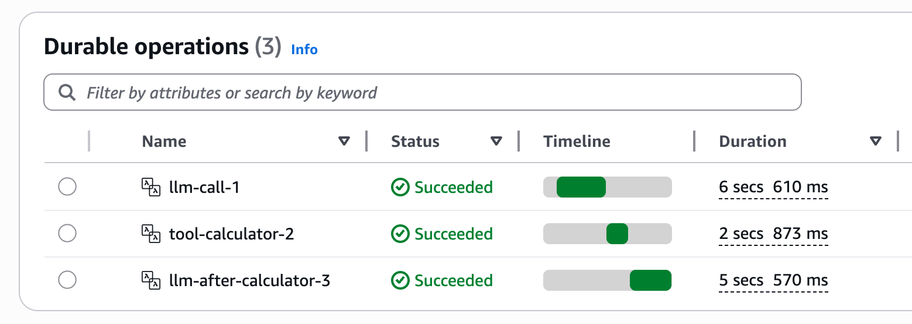

# Strands Agents + Lambda durable functions

[中文文档](README.zh-CN.md)

Run [Strands](https://strandsagents.com/) AI agents on [AWS Lambda durable functions](https://docs.aws.amazon.com/lambda/latest/dg/durable-functions.html)
for fault-tolerant, long-running execution.

## Background

Durable execution for AI agents has become a cross-ecosystem pattern.
[Temporal](https://temporal.io/), [DBOS](https://www.dbos.dev/),
[Restate](https://restate.dev/), Inngest, [LangGraph](https://www.langchain.com/langgraph),
Cloudflare Durable Objects, and
[AWS Lambda durable functions](https://aws.amazon.com/blogs/aws/build-multi-step-applications-and-ai-workflows-with-aws-lambda-durable-functions)
all tackle the same problem: agent runs are getting long (minutes to hours), a
crash loses progress and re-burns tokens, and human-in-the-loop needs long
pauses. The shared principle is to checkpoint at every meaningful step — each
LLM call, each tool result — and replay idempotently from the last checkpoint
rather than starting over.

This project applies that pattern on AWS Lambda durable functions, where the
key question is checkpoint granularity. The official
[sample-ai-workflows-in-aws-lambda-durable-functions](https://github.com/aws-samples/sample-ai-workflows-in-aws-lambda-durable-functions)
repo wraps an entire Strands agent call in a single durable step — simple, but
coarse: a failure reruns everything and you still hit the 15-minute
single-invocation limit. Here, every LLM call and every tool execution is its
own durable step. It does this without rewriting the agent loop or resorting to
subprocess / `os._exit()` hacks: `stream_async` exposes the loop as an event
stream, and the Lambda breaks at message boundaries — which also works for
remote MCP tools.

## How It Works

### The Challenge

A Strands agent's event loop — LLM call → tool execution → LLM call → ... —
runs as a single continuous process. Durable functions checkpoint only at
explicit `ctx.step()` / `ctx.invoke()` boundaries, with no built-in way to
checkpoint in the middle of the loop.

### Architecture

The work is split across two Lambdas:

- **Orchestrator** (Node.js, durable function) — owns the durable loop; calls
  `ctx.invoke()` to run the agent step on each iteration. Every invoke is
  checkpointed automatically by the durable runtime.
- **Agent Step** (Python, regular Lambda) — runs the Strands agent until the
  next tool boundary, then returns control.

The durable execution SDK supports both JavaScript and Python; using both here
demonstrates cross-language collaboration within one durable execution.

### Pause Mechanism

`agent.stream_async()` exposes the event loop as an async event stream. Rather
than stopping the loop from inside a hook, the Agent Step consumes the stream
and stops iterating at the first tool boundary — a plain `break`, with no
subprocess, `os._exit()`, OS pipe, or exit codes.

A lightweight `CheckpointDetector` on `MessageAddedEvent` records the first
boundary it sees:

| Boundary | Fires when | Meaning |
| --- | --- | --- |
| `toolUse` | an assistant message contains a `toolUse` block | the LLM call is done; the tool has not run yet |
| `toolResult` | a user message contains a `toolResult` block | the tool has run; the next LLM call has not started |

Both are event-loop level signals, independent of where a tool is defined —
they fire for local tools and remote MCP tools alike.

> The SDK's interrupt mechanism is not used: a `BeforeToolCallEvent` interrupt
> offers only the "before tool" boundary (too coarse), and tool-level interrupts
> require modifying the tool body, which isn't possible for MCP tools.

### Execution Flow

1. The Agent Step drives `agent.stream_async(prompt)`. The LLM returns a
   `toolUse`, the detector records the boundary, and the Lambda exits the stream.
2. It returns `{"status": "checkpoint", "checkpoint_type": "toolUse",
   "tool_name": ...}` to the orchestrator.
3. The orchestrator re-invokes the Agent Step with only the session id.
4. The Lambda restores history from S3 and drives `agent.stream_async(None)`.
   The tool runs, and the loop reaches the next `toolResult` boundary (exit
   again) or `end_turn` (done).

```
Orchestrator (durable loop)
  │
  ├─ ctx.invoke(agent step, prompt)  ──► LLM returns toolUse  ──► break → checkpoint (toolUse)
  ├─ ctx.invoke(agent step, session) ──► tool runs, toolResult ──► break → checkpoint (toolResult)
  ├─ ctx.invoke(agent step, session) ──► LLM returns toolUse  ──► break → checkpoint (toolUse)
  ├─ ...
  └─ ctx.invoke(agent step, session) ──► LLM returns end_turn ──► done
```

Because the loop breaks at both the `toolUse` and `toolResult` boundaries, every
LLM call and every tool execution becomes its own durable step. The screenshot
below is a real execution for the prompt "calculate 123 * 456 + 789": the
durable runtime recorded three steps — the LLM call that returned a `toolUse`,
the calculator execution, and the final LLM call that produced the answer.



### Session Persistence

Session state (conversation history) is persisted to S3 by `S3SessionManager`,
which writes each message as it is added (`MessageAddedEvent`). That write
happens before the corresponding event reaches the stream consumer, so whenever
the Lambda breaks, the boundary message is already in S3. On the next invocation
the agent loads history from S3 and resumes with `agent.stream_async(None)`; the
tool runs exactly once, in the resume step.

> `S3SessionManager` is one option. The SDK also ships `FileSessionManager` and
> supports custom session managers. See
> [Session Management](https://strandsagents.com/docs/user-guide/concepts/agents/session-management/)
> for details.

### Native Checkpoint Support (Roadmap)

The SDK is building first-class durable-execution support for exactly this use
case: an experimental `strands.experimental.checkpoint` module plus a
`"checkpoint"` stop reason, tracked in
[strands-agents/sdk-python#1369](https://github.com/strands-agents/sdk-python/issues/1369).
Its design matches what this project does by hand:

- the same two cycle boundaries, `after_model` and `after_tools`, which are this
  project's `toolUse` and `toolResult`;
- a `Checkpoint` is only a boundary marker — conversation state is left to a
  `SessionManager`, the same split used here (`S3SessionManager` for state);
- resume mirrors interrupts, via a `checkpointResume` content block and
  `stop_reason="checkpoint"`;
- per-tool granularity is delegated to a custom `ToolExecutor`.

As of the latest release (1.42.0) only the data types and the `"checkpoint"`
stop reason exist; the pause/resume is not yet wired into the event loop, so
this project drives the loop with `stream_async`. Once the native API lands, the
agent step can switch to it without changing the orchestrator or the
two-boundary model.

## Project Structure

```
lambda_agent/handler.py               — Agent step Lambda (Python)
lambda_orchestrator/handler.mjs       — Orchestrator Lambda (Node.js)
template.yaml                         — SAM template
deploy.sh                             — Build and deploy
test.sh                               — Invoke and poll for result
cleanup.sh                            — Empty S3 and delete stack
```

## Prerequisites

- AWS CLI configured with credentials
- [SAM CLI](https://docs.aws.amazon.com/serverless-application-model/latest/developerguide/install-sam-cli.html)
- [Amazon Bedrock](https://docs.aws.amazon.com/bedrock/latest/userguide/model-access.html) model access enabled

## Deploy

```bash
./deploy.sh                    # default stack name: strands-durable-poc
./deploy.sh my-stack           # custom stack name
```

## Test

```bash
./test.sh                                    # default prompt: calculate 123 * 456 + 789
./test.sh my-stack "what time is it"         # custom stack name and prompt
```

The script invokes the orchestrator asynchronously and polls until completion.

## Cleanup

```bash
./cleanup.sh                   # empties S3 bucket and deletes the stack
./cleanup.sh my-stack          # custom stack name
```

## License

[MIT](LICENSE)
